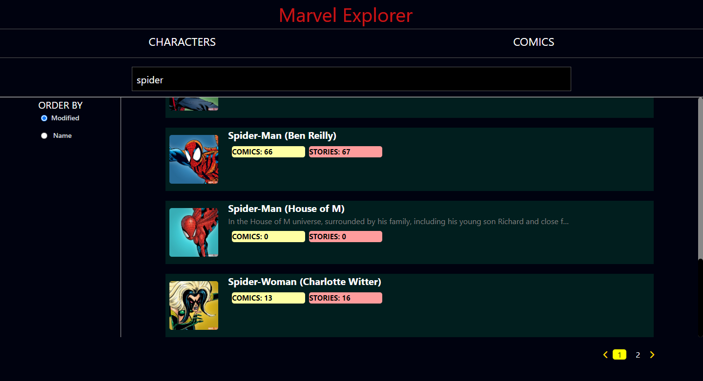
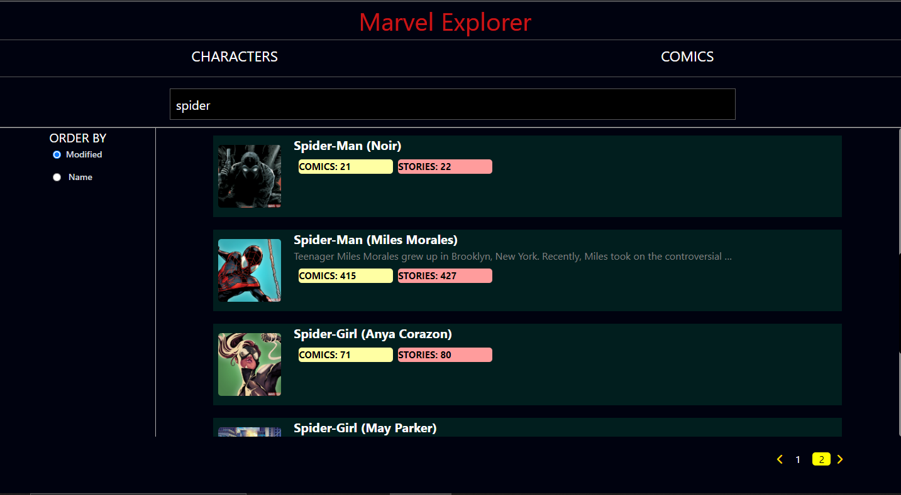
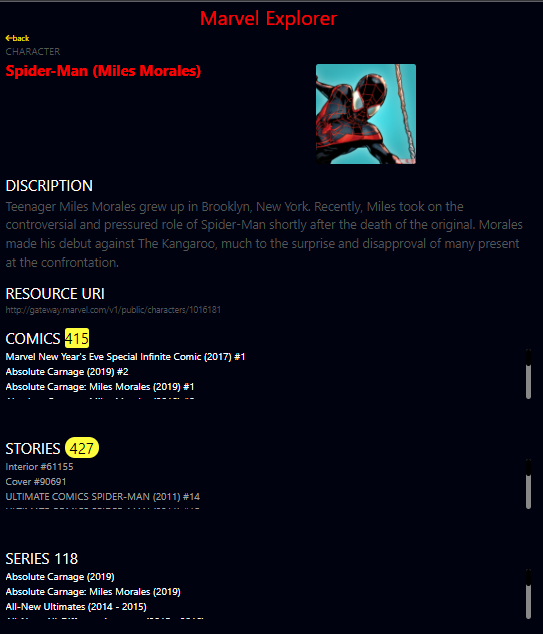
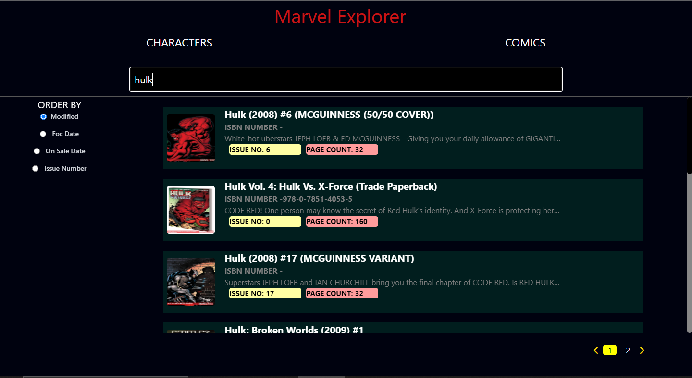
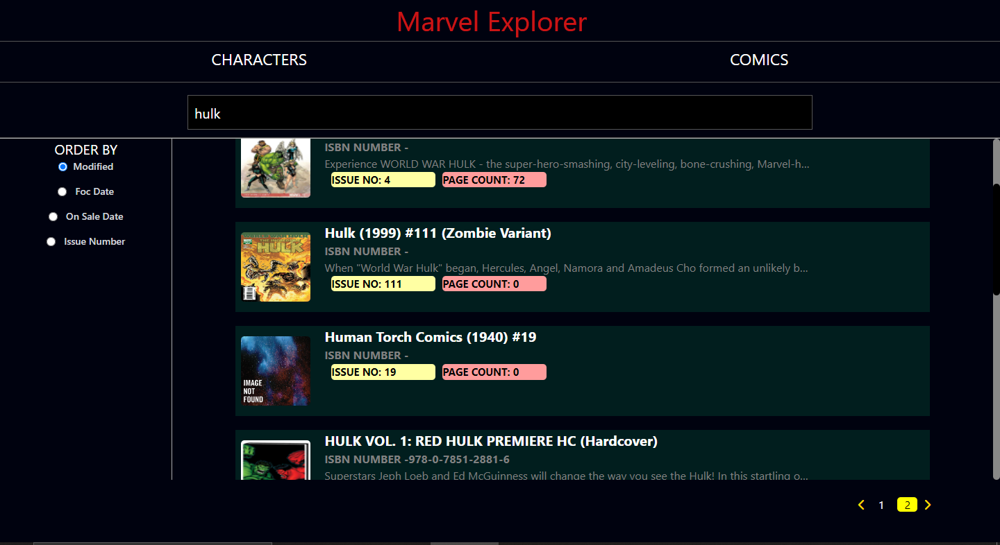
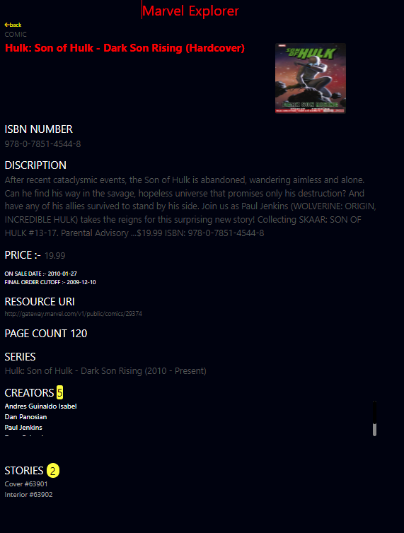

# Marvel Explorer


## Installation

clone this repo

```bash
git clone https://github.com/Tehraankhan/blueskript-assignment-2.git
```
install all dependancies

```bash
npm install
```

start the server

```bash
npm start
```

## Install Tailwind css

```bash

npm install -D tailwindcss postcss autoprefixer

```

```bash
npx tailwindcss init

```

## Install React Router

```bash
npm install react-router-dom

```

## Install  Redux Toolkit

```bash
npm install @reduxjs/toolkit

```

```bash

npm install react-redux

```
## Link To Hosted Website

```bash

https://blueskript-assignment-2-one.vercel.app/

```


## TASKS IMPLEMENTED

.The site consists of two tabs - one for exploring Characters and another for Comics.

### CHARACTER

.Seacrh option to find list of  desire character

.Show a list of character cards with Name, Description, Thumbnail image, Comics (count) tag, and Stories (count) tag.

.Paginated list  10 per request

.Filtering/sorting the list based upo by Modified Date, Name 

.by Click on a character card Show the entire data of that character on new page or new route

### COMICS

.Seacrh option to find list of  desire Comics

.Show a list of Comic cards with Name, Description, Thumbnail image, ISBN Number, Page count tag, and Issue No. tag.

.Paginated list  10 per request

.Filtering/sorting the list based upon  Modified Date, foc date ,on sale date,issue number 

.by Click on a Comic card  Show the entire data of that comic on new page or new route


## IMAGES
### CHARACTER PAGE







### COMIC PAGE








